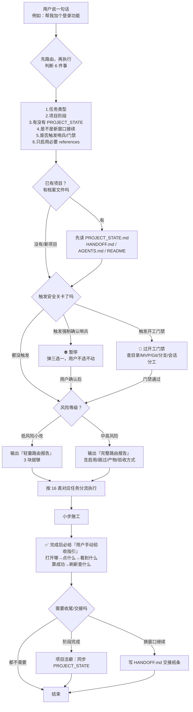
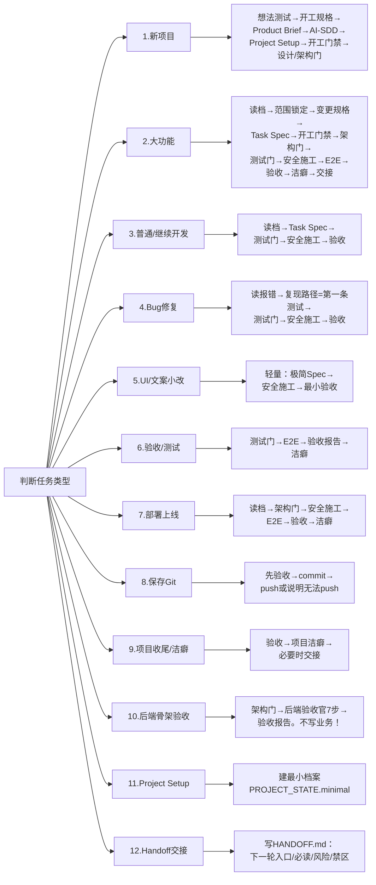
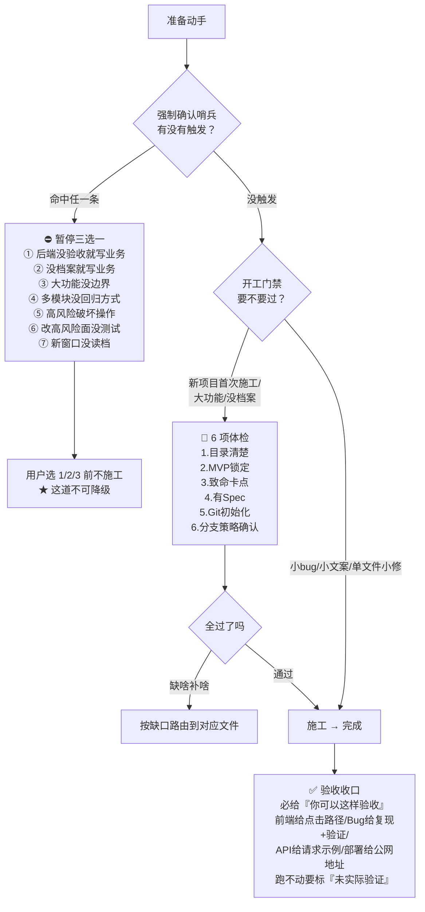

# Kun Coding Router 流程图（V0.7.4）

> 这份文档用图带你看懂整个 skill 怎么运转。GitHub 会自动把下面的 Mermaid 代码渲染成图形。
> 看不懂文字版没关系，先看图，每张图下面都有大白话说明。

---

## 图 1：主流程（Router 收到任务后干什么）

Router 不是「上来就写代码」，而是先判断、再分流、过关卡、最后收口。

**大白话**：
- 任何任务，Router 都先「判断 6 件事」，不会一上来就写代码。
- 已有项目先「读档」（看 PROJECT_STATE / HANDOFF），避免凭印象瞎猜。
- 中间有两道闸门：**强制确认哨兵**（高风险先暂停）和**开工门禁**（正式施工前体检）。
- 小改走轻量，大改走完整，最后**一定告诉你怎么验收**，需要时再交接。

---

## 图 2：12 类任务分流（每种任务走哪几步）

Router 判断出任务类型后，按 16 表跳到对应那一节，只走需要的文件。

**大白话**：
- 同样是「写东西」，新项目要走一长串规划，改个按钮颜色只走 3 步——**这就是 Router 的价值：该重的重，该轻的轻**。
- 越往下（小改、保存）越短，越往上（新项目、大功能）越完整。

---

## 图 3：三道安全关卡（什么时候会拦住你）

这三道是 skill 的「保险」，专门防止 AI 在不稳的地基上乱写。

**大白话**：
- **第一道·哨兵**：最硬，碰到 7 种高风险情况直接暂停问你，哪怕你嫌烦也得先确认（唯一不能跳过的）。
- **第二道·开工门禁**：正式写代码前的「体检」，6 项缺哪补哪；小修小补免检。
- **第三道·验收收口**：干完活必须告诉你怎么亲自验，不准只说「已完成」。

---

## 一句话总结整套 skill

> **先判断（什么任务/什么阶段）→ 读档（别瞎猜）→ 过关卡（高风险先暂停）→ 按任务分流（该重则重该轻则轻）→ 小步施工 → 必给验收指引 → 需要时交接。**

这就是「项目经理 + 验收官」式的调度器：它不替你写所有代码，但保证每一步都不跑偏、能验收、能接续。

---

## 文件速查（这些步骤分别在哪个文件）

| 环节 | 对应文件 |
|---|---|
| 总调度 / 判断 | `SKILL.md` |
| 文件清单 | `references/00-skill-index.md` |
| 想法压力测试 | `references/01-idea-pressure-test.md` |
| 开工规格 | `references/02-spec-start-qiaomu-inspired.md` |
| **开工门禁（关卡 2）** | `references/03-pre-coding-gate.md` |
| Product Brief / MVP | `references/04-product-brief-mvp.md` |
| AI-SDD 规格 | `references/05-ai-sdd-template.md` |
| Task Spec | `references/06-task-spec-template.md` |
| 设计门 / 架构门 | `references/07-design-gate.md` / `08-architecture-gate.md` |
| 测试门 | `references/09-test-first-gate.md` |
| 安全施工 | `references/10-codex-safe-construction.md` |
| Computer-Use E2E | `references/11-computer-use-e2e-gate.md` |
| **验收 / Git / 完成报告（关卡 3）** | `references/12-verification-git-report.md` |
| 项目洁癖 | `references/13-project-cleanup-gate.md` |
| 后端验收官 | `references/14-backend-architecture-acceptance.md` |
| Skill 调用分层 | `references/15-skill-invocation-layer.md` |
| **任务路由表（图 2 来源）** | `references/16-task-routing-map.md` |
| Project Setup | `references/17-project-setup.md` |
| Handoff 协议 | `references/18-handoff-protocol.md` |
